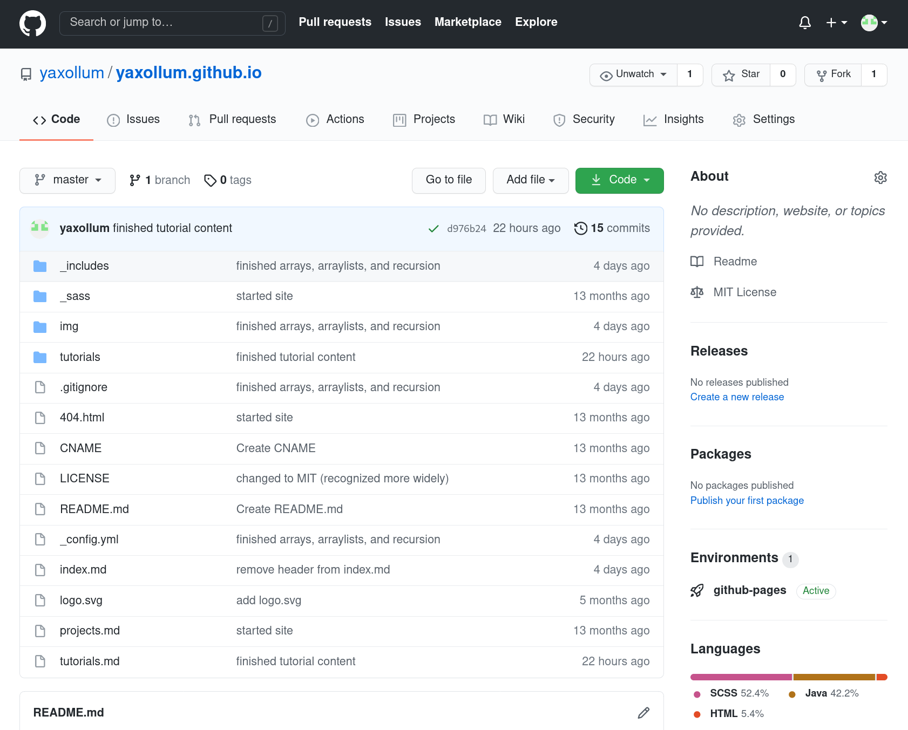

## THIS IS AN ARCHIVED PORTFOLIO. LIST OF PAGES:
- [Tutorials](tutorials)
- [Projects](projects)
- [Sources](sources)

<hr><br>
<div markdown="1">

Hello! I'm Peter Ye, a Grade 11 student attending [William Lyon Mackenzie Collegiate Institute](http://wlmac.ca/). I started this portfolio as my final assignment for Mrs. Krasteva's ICS4U class.

I like programming during my free time, and hope to pursue a career in software engineering. I also enjoy sports such as running, biking, and hockey.

# Building this website

This website is built with [GitHub Pages](https://pages.github.com/) and [Jekyll](https://jekyllrb.com/). 
Jekyll is a **static site generator**; it processes special Markdown code and converts it into HTML. 

## Markdown
The advantage of writing Markdown (and then converting it into HTML) instead of manually writing plain HTML is that the syntax is more concise. For example, the paragraph above looks like this in Markdown:
```markdown
This website is built with [GitHub Pages](https://pages.github.com/) and [Jekyll](https://jekyllrb.com/).
Jekyll is a **static site generator**; it processes special Markdown code and converts it into HTML.
```

That same paragraph looks like this in HTML:
```html
<p>This website is built with <a href="https://pages.github.com/">GitHub Pages</a> and <a href="https://jekyllrb.com/">Jekyll</a>.
Jekyll is a <strong>static site generator</strong>; it processes special Markdown code and converts it into HTML.</p>
```

## Automatic page generation
Jekyll's automatic page generation is also very convenient, as it allows you to write content (e.g. header bar, footer bar) in one place and have it duplicated on different pages. 

I used this feature heavily when writing the [tutorials](tutorials.html) on this website. Let's say I have a Java program demonstrating object oriented programming which I'd like to include within a tutorial. I can use the following Jekyll syntax to do this:


```

```


This way, whenever I modify my Java program (located at `programs/basic_task/Task.java`), the tutorial content will also be automatically updated. This saves a lot of manual copying and pasting, which not only is inefficient, but can also cause inconsistencies between content at different locations.
</div>

## View my code!
All of the code used to build this website is available on [its GitHub repository](https://github.com/yaxollum/yaxollum.github.io).



<style>
    .round-image {
    border-radius: 50%;
  max-width: 30%;
    }
</style>
