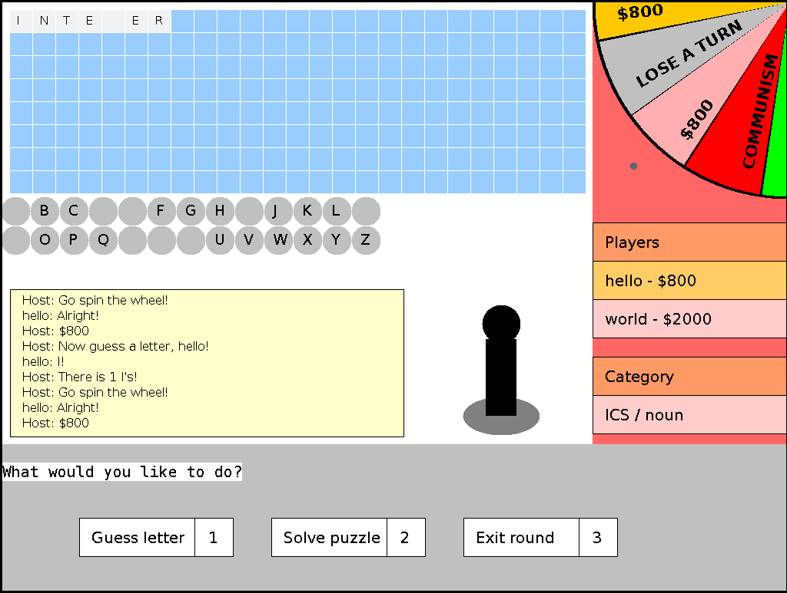
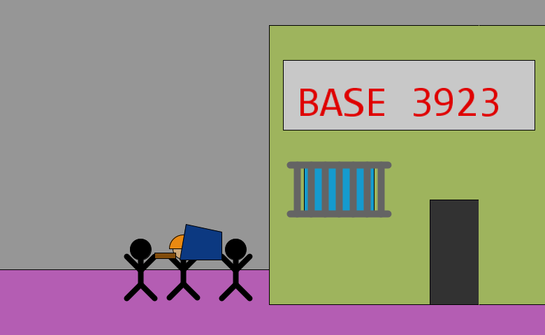
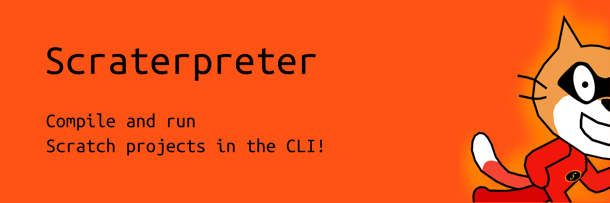

I have worked on many projects both in school, and outside of school. This page gives a quick overview of a few of them, and explains the skills which I learned while completing them:

# Wheel of Fortune

For my ICS3U final project, I worked with Paul Lee to recreate the popular Wheel of Fortune game using Java and HSA. I learned more about Java graphics and documenting my code effectively using comments.

# Megavolt's Escape

[Megavolt's Escape](https://github.com/yaxollum/MegavoltsEscape) is my ICS2O final project, which I wrote using Processing. When creating it, I learned improved my knowledge of the Processing language (e.g. graphics, handling mouse and keyboard events).

# Scrape

[Scrape](https://github.com/scraterpreter/scrape) is a command-line Scratch interpreter which I built outside of school in collaboration with Paul Lee. Its main purpose is to allow online judges such as [MCPT](https://mcpt.ca) and [PNOJ](https://pnoj.dev) to judge Scratch submissions.

When working on this project, I improved my understanding of object oriented programming and learned how to distribute software packages using Snap and Flatpak.

