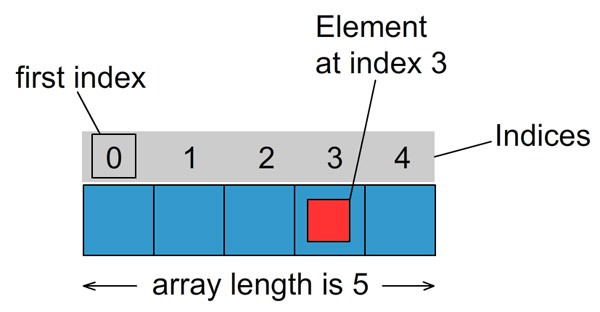

An **array** is a list of values of the same type. Arrays allow programmers to access multiple values using one identifier.



(Image from javatutorial.net)

# Example problem

Consider this problem:
> Given 6 words, output them in reverse order.

For example, if the input is:
```
I really enjoy doing ICS homework
```
then the output should be:
```
homework ICS doing enjoy really I
```

## Without an array

Without using an array, this is what the program could look like:

```java
public static void revInputNoArray() {
    String w1, w2, w3, w4, w5, w6;
    Scanner input = new Scanner(System.in);
    w1 = input.next();
    w2 = input.next();
    w3 = input.next();
    w4 = input.next();
    w5 = input.next();
    w6 = input.next();
    System.out.println(w6 + ' ' + w5 + ' ' + w4 + ' ' + w3 + ' ' + w2 + ' ' + w1);
}
```

Clearly, this is tedious to write, and the code is very repetitive. If there were 1000000 words instead of 6 words, then this would take nearly forever to code.

## With an array

Let's see how we can improve this by using an array:

```java
public static void revInputWithArray() {
    String[] words = new String[6];
    Scanner input = new Scanner(System.in);
    for (int i = 0; i < 6; ++i) {
        words[i] = input.next();
    }
    for (int i = 5; i >= 0; --i) {
        System.out.print(words[i] + ' ');
    }
    System.out.println();
}
```

The code above looks much less repetitive. `words` is an array of 6 `String`s, which can be iterated over using a `for` loop.

Java arrays are declared with the syntax `Type[] identifier` and created using the syntax `new Type[length]`. 

To access an element in an array, you put the element's **index** within square brackets. Java arrays are **zero-indexed**, meaning that the indexes start from zero and go up to the length of the array minus one. The first element is at index 0, the second is element is at index 1, the third element is at index 2, and so on.

# Other syntax

## Specifying initial elements

Another way to create an array is by listing its initial elements. The code below creates an array named `phrases` which contains 3 `String`s, and initializes the `String`s.

```java
String[] phrases={"hello", "goodbye", "good morning"};
```
## Getting the length of an array

To get the length of an array, use its `length` property:
```java
System.out.println(phrases.length); // should print "3"
```

## Foreach loop

To loop over the elements of an array, you can use a `for` loop:

```java
for (int i = 0; i < phrases.length; ++i) {
    System.out.println(phrases[i]);
}
```

Alternatively, if you need to iterate over the elements, but don't need to assign values to them, you can use the more concise **foreach** loop:

```java
for (String phrase : phrases) {
    System.out.println(phrase);
}
```

The **foreach** loop eliminates the need for a counter variable; you just specify a name for the variable used to access each element (`phrase` in this example).

# Conclusion

Arrays are an essential part of Java; without them, you wouldn't be able to efficiently work with large amounts of data. Hopefully this tutorial helped familiarize you with Java arrays. The next tutorial will cover the `ArrayList` data structure, which is similar to an array, except it can be resized dynamically.

# Sources

