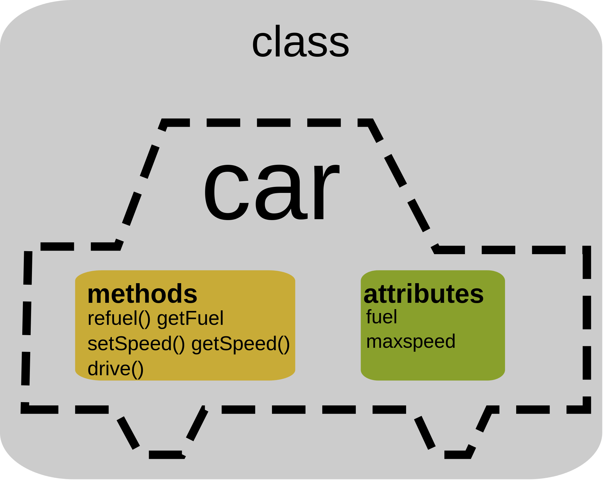

# What is OOP?

Object-oriented programming (OOP) is a way to solve programming problems by representing them as **objects**. An object is a structure defined by a programmer that includes **attributes** and **methods**. Attributes store an object's data as variables. Methods perform actions on an object, which may include modifying the object's attributes.



(Image from miltonmarketing.com)

# Example: A to-do list task

Let's say we're building a to-do list application using Java. To model each task in a to-do list, we should use an object.

## Attributes
Here are some attributes which a task object should have:
- Name
- Duration (the amount of time required to complete the task)
- Priority
- Percentage complete

## Methods
Here are some methods that can be applied to a task object 
- Extend duration (increase the time required)
- Bump priority (increase the priority by one)
- Update completion (increase the percentage complete by a specific amount)

## Code
In Java, an object is created using a class. A class is a template for an object that specifies all of its attributes and defines all of its methods. Java classes are written in a file with the same name as the class name, but with `.java` appended to the end. For this example, here is what a basic `Task` class looks like in Java (this class should be written in a file called `Task.java`:

```java

```

# Constructing an object

The process of creating an object from a class is known as **instantiation**. Instantiation involves allocating a region of computer memory for an object, setting the initial values for an object's attributes, and performing any other necessary tasks (e.g. opening a file or network stream).

In Java, instantiation is done by calling the **constructor** of a class. A constructor is a special method whose purpose is to initialize the object. It must be defined with the same name as the class. In our previous `Task` class example, this is what its constructor would look like:

```java

```

The `Task()` method is the constructor which initializes all of the attributes to default values.

Now we can test our `Task` class in a main method in a separate file called `TestTask.java`:

```java

```

# Encapsulation

**Encapsulation** is the restriction of access to an object's data. Java offers different access modifiers to specify how much you want to restrict access. 

The four different levels of access are: `public`, `private`, `protected`, and *package-private*. Note that *package-private* is not an actual keyword; it's just the default access level when no modifier is explicitly specified.

From [Oracle's Java OOP Tutorial](https://docs.oracle.com/javase/tutorial/java/javaOO/accesscontrol.html):

|Modifier|Class|Package|Subclass|World|
|--------|-----|-------|--------|-----|
|`public`|y|y|y|y|
|`protected`|y|y|y|n|
|*no modifier (package-private)*|y|y|n|n|
|`private`|y|n|n|n|

Currently, in our `Task` class, none of the attributes or methods have explicit access modifiers, so they are all *package-private*.

The idea of encapsulation involves hiding all of the fields as `private`, and making methods `public`. This ensures that any code which uses `Task` objects outside of the class won't incorrectly modify the object's data (e.g. by setting `duration` to a negative number).

Now that the members are private, we will need **accessors** to allow them to be read outside of the class. In this case, each member variable should have its own accessor: `getName` for `name`, `getDuration` for `duration`, `getPriority` for `priority`, and `getPercentage` for `percentage`.

```java

```

The `printTask()` method in the `TestTask` program needs to be modified to use the accessor methods instead of accessing the fields directly:

```java

```

# Conclusion

This concludes my tutorial about object-oriented programming. To summarize, OOP allows you to represent problems as objects. Objects provide an effective way to structure your programs. OOP introduces the concept of encapsulation, where objects hide their implementation details by only allowing access to their data through a public interface. Encapsulation can help prevent bugs, since all accesses to the objects can be checked for correctness and consistency.

# Sources

