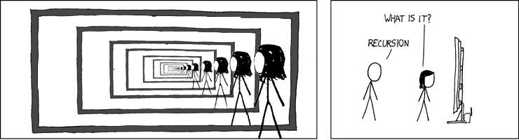

# What is Recursion?

**Recursion** is a programming technique where a function calls itself. It allows problems to be broken down into smaller subproblems. Each subproblem can either be broken down further or solved directly.



(Image from theburningmonk.com)

# Example: Factorial

## Definition

In math, the factorial of a whole number `N` is defined as the product of all integers from `1` to `N`. The factorial of `N` is written as `N!`. For example,

```
1! = 1
2! = 2x1 = 2
3! = 3x2x1 = 6
4! = 4x3x2x1 = 24
```

Additionally, by definition, `0!` (a special case) is equal to `1`.

## Recursive definition

Factorial can also be defined recursively:
```
0! = 1
N! = N * (N-1)!
```

## Stepping through the recursive definition

Using the recursive definition, let's see what happens when we try to calculate `4!`:

1. `4! = 4 * (4-1)! = 4 * 3!`
2. We need the value of `3!`: `3! = 3 * 2!`
3. We need the value of `2!`: `2! = 2 * 1!`
4. We need the value of `1!`: `1! = 1 * 0!`
5. We need the value of `0!`: `0! = 1` (by definition)
6. Backtrack to step 4: `1! = 1 * 1 = 1`
7. Backtrack to step 3: `2! = 2 * 1 = 2`
8. Backtrack to step 2: `3! = 3 * 2 = 6`
9. Backtrack to step 1: `4! = 4 * 6 = 24`

In this example, `0!` is known as the **base case**. The base case is a problem which can be solved without making any recursive calls. All recursive functions require a base case in order to terminate; without a base case, the recursion would be infinite.

Once the base case has been reached, the program backtracks through all the recursive calls, solving each intermediate problem (`1!`, `2!`, `3!`), and eventually returning to solve the original problem (`4!`).

## The code

Now it's time to code a recursive `factorial()` function in Java. The Java code looks very similar to the mathematical definition: ([download a full working example](/programs/factorial/Factorial.java))

```java
public static int factorial(int n) {
    if (n == 0) {
        return 1;
    } else {
        return n * factorial(n - 1);
    }
}
```

# Conclusion

In conclusion, recursion allows us to split a problem into multiple smaller problems, whose solutions can be combined to give us the solution to the original problem. This strategy can help us avoid being overwhelmed by a complex problem, and lets us to write an elegant solution that solve the problem in small steps.

# Sources

