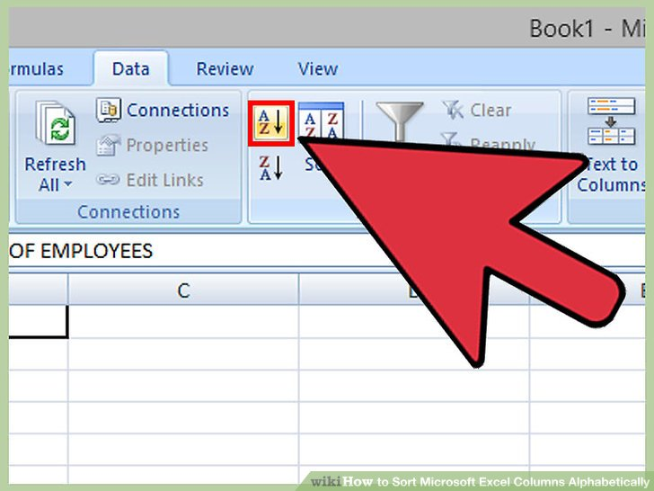

# Introduction

Sorting is one of the most common operations on a list of values. When you want to display some data in a certain order, or organize it for further processing, you will often want to sort the data.

This tutorial will cover two sorting algorithms: insertion sort and bubble sort. In practice, these algorithms are not used on large datasets due to their low efficiency, but they are useful as learning resources.



(Image from wikihow.com)

# Insertion sort

Insertion sort takes each value in a list and inserts it into the correct position in a new list. After all of the elements are inserted into the new list, the new list will be sorted. 

## Code
To implement insertion sort in Java, we can use an `ArrayList`, which is helpful because it allows us to easily insert elements in the middle of the list. Here is the code:

```java

```

## Time complexity

We can calculate the time complexity of insertion sort by analyzing the nested `for` loop:

```java
for (int num : nums) {
    for (int i = 0; i <= sorted.size(); ++i) {
        // do stuff in here
    }
}
```

The outer loop runs `nums.length` times, as it loops over each element of `nums`. The inner loop, which determines where to insert `num`, runs until the correct position is found, so at most `sorted.size()+1` times.

Now, to represent the time complexity in big O notation, we can set *N* to be the length of the `nums` array. The outer loop runs *N* times, and the inner loop runs on the order of *N* times. We know that the inner loop doesn't run exactly *N* times per execution, but this doesn't matter, as big O notation does not include any constants or coefficients. Since this is a nested loop, the time complexity is the number of iterations of the outer loop multiplied by the number of iterations of the inner loop, so *N&middot;N*, which equals *N<sup>2</sup>*. 

Written in big O notation, it is *O(N<sup>2</sup>)*.

# Bubble sort

Bubble sort works by iterating multiple times through an array, swapping adjacent elements if they are out of order. The algorithm terminates when it passes through the array without needing to make any swaps.

## Code

This algorithm is fairly straightforward to implement in Java:

```java

```

## Time complexity

To calculate bubble sort's time complexity, we have to look at the nested loop:

```java
while (!sorted) { 
    for (int i = 1; i < nums.length; ++i) {
        // do stuff in here
    }
}
```

Unlike insertion sort, the outer loop is a `while` loop instead of a `for` loop. The `while` loop executes until `sorted` is `true`. It may seem difficult to determine the number of times the `while` loop will execute. Without additional knowledge about the program, we have no idea about whether the loop will terminate at all! 

Fortunately, we can get a better understanding of the sorting algorithm by watching a video demonstration (if the video feels too slow, you can increase the speed in the playback settings):

<iframe width="560" height="315" src="https://www.youtube.com/embed/xli_FI7CuzA" title="YouTube video player" frameborder="0" allow="accelerometer; autoplay; clipboard-write; encrypted-media; gyroscope; picture-in-picture" allowfullscreen></iframe>

<br>
You can see from the video that *each time the outer loop runs, an element gets colored in green, meaning that it has been placed in the correct position and will not be moved again*. 

For an array of *N* elements, this means that the outer loop will run at most *N* times, finalizing the position of at least one element each time (the loop may terminate early if it finds that the array has already been sorted).

The inner loop runs *N* times, as it iterates through the entire array.

Now that we know the number of iterations of the outer and inner loop, we can simply multiply them to get the time complexity of the entire algorithm: *N&middot;N*, which equals *N<sup>2</sup>*. 

Written in big O notation, the time complexity of bubble sort is *O(N<sup>2</sup>)*.

# Conclusion

This tutorial covered two sorting algorithms: insertion sort and bubble sort. Although these algorithms aren't efficient enough for sorting large datasets in real world programs, they are a great exercise for practicing Java programming and also analyzing the time complexity of an algorithm.

# Sources

